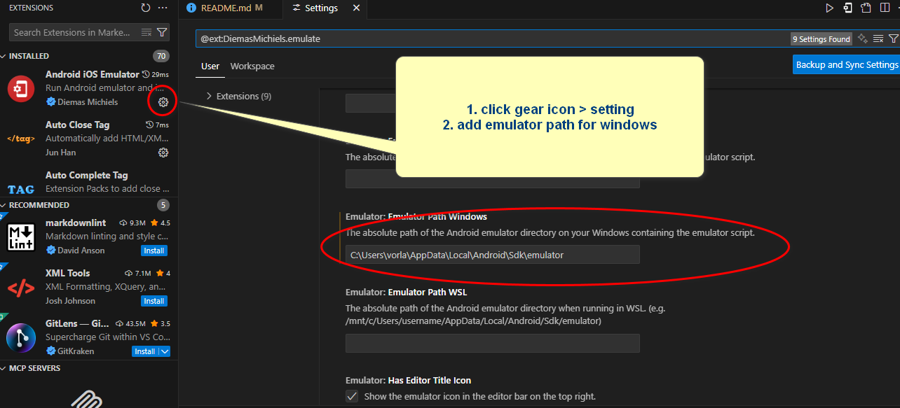
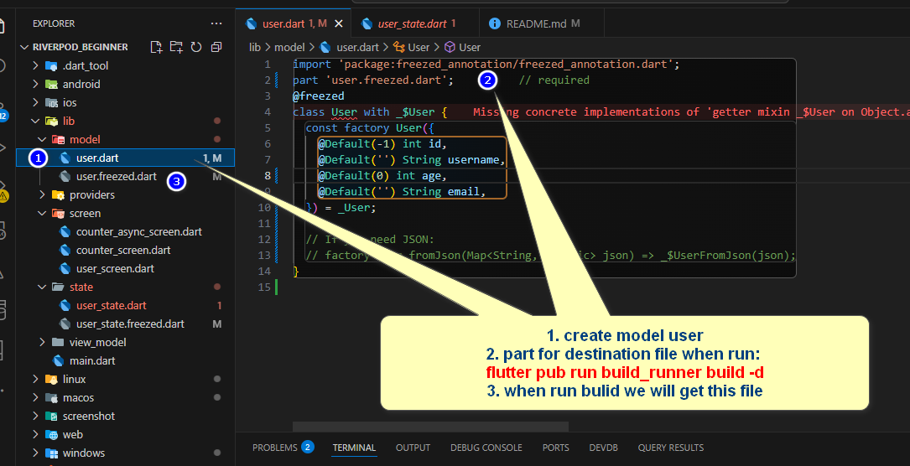

# riverpod_beginner
A new Flutter project with Riverpod State Management.

## Vscode extension
1. blockman
2. flutter snippets
3. codeium (ai code), copilot
4. dart data class generator
5. flutter & Dart Utilities
6. flutter riverpod snippets
7. flutter widget snippets
8. material icon theme
9. error lens

## setup vscode run android emulator
- install: android ios emulator
- setting run emulator path
C:\Users\vorla\AppData\Local\Android\Sdk\emulator

<!-- installation -->
## Create flutter project with command
```
fluttercreate -e <app name>
```
## Flutter Riverpod State Management package
https://pub.dev/packages/flutter_riverpod/install
```
flutter_riverpod: ^2.6.1
```
<!-- Flutter freezed Package -->
## Freezed package
https://pub.dev/packages/freezed

```
flutter pub add freezed_annotation
flutter pub add dev:build_runner
flutter pub add dev:freezed
flutter pub add json_annotation
flutter pub add dev:json_serializable
```
create model user.dart

```
flutter pub run build_runner build -d
```
Regenerate (clear stale outputs)
```
flutter pub get
dart run build_runner clean
dart run build_runner build --delete-conflicting-outputs
```